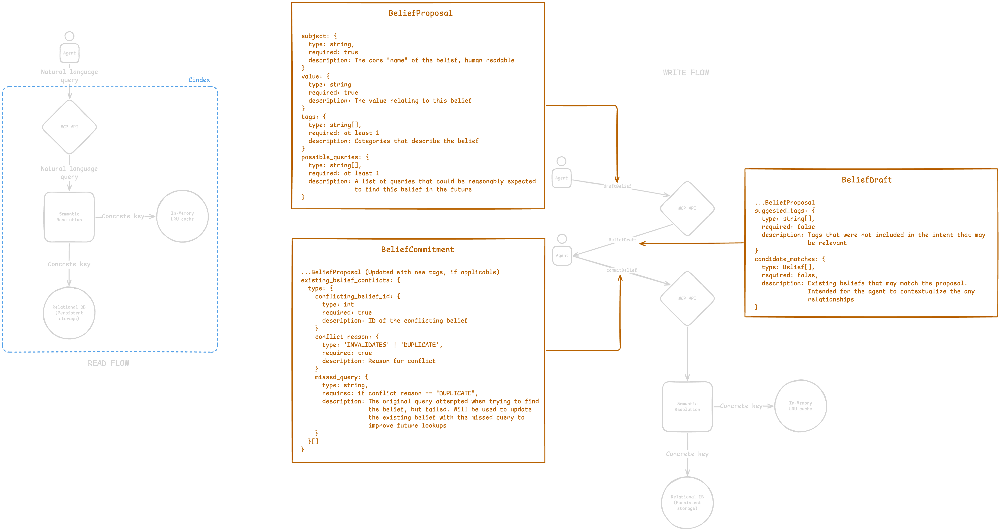

# Tesseract 

A semantic context layer for agent workflows

---

## Overview

Agent workflows are typically stateless. Given a task, an agent will search the repository, inspect files, and infer structure each time it runs.

Tesseract provides a system where agents can retain and reuse context across runs instead of rediscovering it.

---

## Why not just markdown?

A common approach is to store context in markdown files (e.g. `memory.md`, `notes.md`) and have the agent read and update them.

This works, but has limitations:

- context becomes unstructured and harder to query  
- agents must read entire files to find relevant information  
- duplicate or conflicting entries accumulate over time  
- keeping files clean requires manual effort or strict conventions  

Tesseract replaces this with a structured system where context can be:
- queried directly using natural language  
- updated or replaced without manual cleanup  
- incrementally improved as agents interact with it  

---

## What it does

- Stores context discovered by agents  
- Resolves natural language queries to relevant information  
- Persists knowledge across runs  
- Allows new information to replace or refine existing context  

---

## Architecture



---

## Usage

Start Tesseract:

```bash
tesseract start
```
