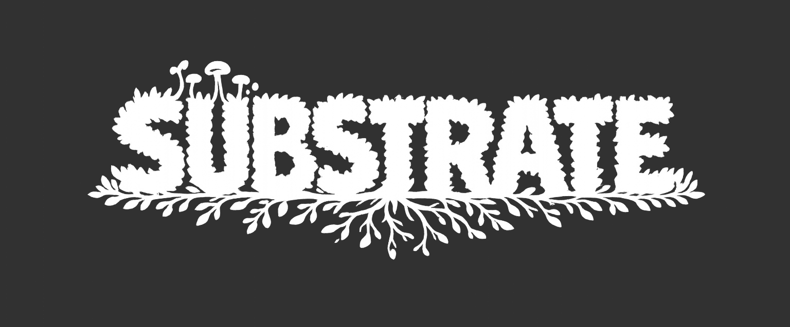

# Substrate

Substrate is a local context layer for AI agents.

It runs as a local daemon, exposes an MCP server, and lets agents persist useful project knowledge across runs instead of rediscovering the same context every time they start.

Agents can use Substrate to remember things like:

- where important files live
- how a project is built, tested, or started
- repository-specific conventions
- user preferences
- architectural decisions
- gotchas discovered during previous tasks

The goal is not to replace your repository, documentation, or notes. The goal is to give agents a structured, queryable memory layer they can use before falling back to filesystem search and guesswork.

## Table of Contents
- [Why not just markdown?](#why-not-just-markdown)
- [What Substrate does](#what-substrate-does)
- [What Substrate stores](#what-substrate-stores)
- [How Substrate is used](#how-substrate-is-used)
- [Status](#status)
- [Setup](#setup)
  - [Using a release build](#using-a-release-build)
  - [Building from source](#building-from-source)
- [CLI reference](#cli-reference)
- [Configuration](#configuration)
- [Architecture](#architecture)
- [Roadmap](#roadmap)
- [Development](#development)

## Why not just markdown?

A common approach is to store context in markdown files like `memory.md`, `notes.md`, or agent-specific rules files.

That can work, but it has limitations:

- context becomes unstructured over time
- agents often need to read entire files to find one relevant fact
- duplicate or conflicting entries accumulate
- stale information is hard to identify
- cleanup requires manual effort or strict conventions
- different agents may use different memory formats

Markdown still has a place. Project documentation, READMEs, and architectural notes are all useful. Substrate is meant to sit beside those systems as a local, retrieval-oriented memory layer for agents.

Instead of asking an agent to repeatedly scan loosely organized notes, Substrate gives agents a structured system where context can be queried directly, updated intentionally, and retrieved based on meaning rather than file position.

## What Substrate does

Substrate currently focuses on:

- storing context discovered by agents
- resolving natural language queries to relevant information
- persisting knowledge across agent runs
- allowing new information to replace, duplicate, or refine existing context
- exposing this functionality through an MCP-compatible interface

## What Substrate stores

Substrate stores small, structured pieces of reusable context called beliefs.

A belief should be atomic, self-contained, and useful to retrieve later. For example:

```text
The frontend app is located in apps/web and starts with pnpm dev.
```

That is more useful than a vague note like:

```text
Frontend stuff.
```

Substrate is designed around the idea that agents should store context in a form that future agents can retrieve by asking natural language questions like:

```text
How do I start the frontend?
```

or:

```text
Where does the app keep its database migrations?
```

## How Substrate is used

Substrate runs locally as a background process. Once running, your agent connects to Substrate through its MCP server.

A typical workflow looks like this:

1. Start the Substrate daemon.

2. Configure your agent to use Substrate's MCP server.

3. Ask your agent to work normally.

4. The agent queries Substrate when it needs project or user context.

5. The agent stores useful discoveries back into Substrate for future runs.

For example, if an agent learns that your frontend app starts with `pnpm dev` from the `apps/web` directory, it can store that once. Later agents can retrieve that fact directly instead of scanning package files or guessing commands again.

## Status

Substrate is currently early-stage software. Release builds are intended to include the local runtime dependencies needed to use Substrate directly.

If you are building from source, you will need to download model files manually as part of the development setup.

## Setup

How you set up Substrate depends on whether you are using a released build or building the project from source.

### Using a release build

If you downloaded a release build, you do not need to install the Hugging Face CLI or manually download models. The release package includes everything Substrate needs to run locally.

#### Install Via Homebrew
```bash
brew tap alexdovzhanyn/tap
brew install substrate
```

Start the daemon:

```bash
substrate start
```

Check that it is running:

```bash
substrate status
```

Then configure your agent to connect to Substrate's MCP server:

```text
http://localhost:4004/mcp
```

The exact MCP configuration depends on the agent you use. In general, look for that agent's MCP server configuration, add Substrate as a local MCP server, and restart or reload the agent so it discovers the Substrate tools.

### Building from source

If you are building Substrate from source, you need to download the local embedding and reranking models manually.

First, install the Hugging Face CLI:

```bash
brew install hf
```

Then download the required models into the `models/` directory:

```bash
hf download BAAI/bge-small-en-v1.5 --local-dir models/bge-small-en-v1.5

hf download BAAI/bge-reranker-base --local-dir models/bge-reranker-base
```

After downloading, your directory should look roughly like this:

```text
models/

  bge-small-en-v1.5/

    config.json

    tokenizer.json

    model.safetensors

    pytorch_model.bin

    onnx/

      model.onnx

  bge-reranker-base/

    ...
```

Once the models are downloaded, build and run Substrate from source using the normal project build flow.

## CLI reference

Start Substrate as a background daemon:

```bash
substrate start
```

Run Substrate in the foreground, which is useful for debugging or development:

```bash
substrate start --foreground
```

Check whether Substrate is running:

```bash
substrate status
```

Stop the daemon:

```bash
substrate stop
```

Launch the management console:

```bash
substrate console
```

View logs:

```bash
substrate logs
```

Clear logs:

```bash
substrate logs --clear
```

Delete all stored belief data:

```bash
substrate flush
```

`flush` is destructive. It clears Substrate's stored context.

View config location:

```bash
substrate config
```

## Configuration

Substrate is configured with a local config file.

A representative config looks like this:

```toml
[retrieval]
semantic_top_k = 20
max_l2_distance = 1.2
retrieval_limit = 5
reranker_min_score = 0.5

[storage]
lancedb_file = "data/lancedb"
sqlite_file = "data/substrate.sqlite"

[http]
port = 4004

[logging]
level = "info"
```

The current configuration schema is:

```rust
pub struct Config {
  pub retrieval: RetrievalConfig,
  pub storage: StorageConfig,
  pub http: HttpConfig,
  pub logging: LoggingConfig,
}

pub struct RetrievalConfig {
  pub semantic_top_k: usize,
  pub max_l2_distance: f32,
  pub retrieval_limit: usize,
  pub reranker_min_score: f32,
}

pub struct StorageConfig {
  pub lancedb_file: String,
  pub sqlite_file: String,
}

pub struct HttpConfig {
  pub port: usize,
}

pub struct LoggingConfig {
  pub level: String,
}
```

### Retrieval settings

`semantic_top_k` controls how many semantic candidates are initially retrieved before filtering and reranking.

`max_l2_distance` controls how far away a semantic match is allowed to be before it is discarded.

`retrieval_limit` controls how many final beliefs are returned after filtering and reranking.

`reranker_min_score` controls the minimum reranker score required for a belief to be included in the final result.

### Storage settings

`lancedb_file` is the local path used for vector storage.

`sqlite_file` is the local path used for structured belief storage.

### HTTP settings

`port` controls the local port used by the Substrate daemon, HTTP API, and MCP server.

### Logging settings

`level` controls log verbosity. Typical values are:

```text
trace

debug

info

warn

error
```

## Architecture

At a high level, Substrate has five main pieces:

1. A local daemon that manages the runtime process.

2. A structured storage layer for belief data.

3. A semantic retrieval layer for matching natural language queries to stored context.

4. An MCP server for agents to interact with.

5. An HTTP API for external applications to interact with.

The semantic layer retrieves candidate beliefs, filters them, reranks them, and returns the most relevant stored context to the agent.

## Roadmap

Planned features include the following.

### First-time setup detection

On first launch, Substrate should detect common local agents and offer to configure them automatically where possible.

This may include:

- detecting installed agents
- detecting agent config locations
- offering to add Substrate as an MCP server
- offering to install agent-specific hooks when supported

The goal is to make the first-run path feel closer to “install Substrate and approve the integrations you want” rather than requiring users to manually find and edit every agent config file.

### Belief scoring

Beliefs may eventually be scored based on signals like:

- agent upvotes
- access recency
- creation recency
- conflict history

This should help Substrate prefer context that has proven useful over time.

For example, a belief that has been retrieved often, confirmed by agents, and not contradicted by newer information should rank higher than a stale belief created months ago and never used again.

### Query debugging

A planned debugging interface in the management console should explain the retrieval pipeline for a given query.

For example:

```text
how do i start my project
```

The debugger should show:

- embeddings found
- candidates filtered by L2 distance
- reranking output
- final results after limits are applied

This is intended to make retrieval behavior inspectable. If Substrate returns the wrong belief, or fails to return an expected belief, the user should be able to see where the result was lost: initial semantic search, distance filtering, reranking, or final limiting.

### Belief validator scripting

Substrate may support validator scripts, likely through Lua, for automatic belief validation and cleanup.

Validators would allow users or projects to define custom rules for checking whether a belief is still true. This matters because some stored context is stable, while other context can become stale quickly.

For example, a validator could check whether a path mentioned in a belief still exists, whether a command still appears in `package.json`, whether a referenced config file is still present, or whether a service name still exists in a compose file. If the validator fails, Substrate could mark the belief as stale, lower its score, or ask an agent to re-check it before trusting it.

The goal is not to make agents blindly execute arbitrary cleanup. The goal is to give Substrate a controlled way to detect when stored knowledge may no longer match the local environment.

### Workstreams

Workstreams are planned as short-term task memory for larger pieces of work that span multiple agent runs.

Beliefs are intended to be durable, reusable facts. Not every useful piece of task context belongs there. When an agent is working on a specific ticket, bug, refactor, or investigation, it may accumulate temporary knowledge that is important for the task but not useful as permanent project memory.

A workstream would give that context a dedicated place to live.

For example, if an agent is halfway through a bug fix and the conversation context needs to be reset, the next agent should be able to recover the important state of the work: what was already tried, what files were changed, what hypothesis is currently being tested, what commands failed, and what still needs to be done.

Unlike beliefs, workstreams would likely have an expiration date or some other cleanup mechanism. They are meant to preserve continuity across agent runs without turning every intermediate observation into long-term memory.

A workstream might be keyed by a ticket ID, branch name, task name, or generated identifier. It should also be semantically discoverable, so an agent can recover the right workstream even if it does not know the exact ID.

## Development

Run Substrate in the foreground while developing:

```bash
substrate start --foreground
```

Check logs with:

```bash
substrate logs
```

Clear local belief data when testing from a clean slate:

```bash
substrate flush
```
